<div align="center">


<br>

<a href="https://github.com/estevaosimao">

</a>

<a href="https://github.com/estevaosimao">

</a>

<a href="https://esbmgroup.co.mz/">

</a>

</div>

---

# 👋 Olá, chamo-me Estevão Simão

🎓 **Computer Science Student**
💻 **Full-Stack Developer**
🎨 **3D & Motion Designer**
🚀 **Building, learning and improving every day.**

Sou estudante de **Engenharia Informática e de Computadores**, apaixonado por tecnologia, desenvolvimento de software, design e criação de experiências digitais.

Atualmente estou focado em construir uma base sólida em **Full-Stack Development**, enquanto exploro **Cloud, Software Engineering, 3D Web e Computer Graphics**.

---

## 🧠 Sobre Mim

* 🎓 Estudante do **2.º ano de Engenharia Informática e de Computadores — ISUTC**
* 💻 Desenvolvimento Web com **JavaScript, React, Next.js e Node.js**
* 🎨 Experiência em **Branding, UI Design, Motion Design e Design Digital**
* 🧊 Exploração de **Blender, 3D Modeling e Web 3D**
* ☁️ Atualmente estudando **AWS & Cloud Architecture**
* 🧠 Interessado em **Software Engineering, Cybersecurity e Systems**
* 🚀 Construindo projetos para transformar conhecimento em experiência prática

---

## ⚡ Tech Stack

### 💻 Development

<p>

</p>

### ☁️ Cloud & Infrastructure

<p>

</p>

### 🎨 Design & 3D

<p>

</p>

---

## 🚀 What I'm Building

| Area                    | Focus                                       |
| ----------------------- | ------------------------------------------- |
| 💻 Full-Stack           | Modern web applications & SaaS              |
| ☁️ Cloud                | AWS, deployment & infrastructure            |
| 🧠 Software Engineering | Architecture, APIs & scalable systems       |
| 🔐 Cybersecurity        | Security fundamentals & practical labs      |
| 🧊 3D Web               | Three.js, Blender & interactive experiences |
| 🎨 Design               | Branding, UI/UX & Motion Design             |

---

## 📊 GitHub Analytics

<div align="center">

<a href="https://github.com/estevaosimao">

</a>

<a href="https://github.com/estevaosimao">

</a>

</div>

---

## 🏆 GitHub Trophies

<div align="center">


</div>

---

## 📈 Contribution Activity

<div align="center">


</div>

---

## 💼 ESBM Group

Through **ESBM Group**, I work across technology and digital creativity.

### Services

💻 **Web Development**
Modern, responsive and performance-focused websites and applications.

🎨 **Branding & Identity**
Logo design, visual identity and brand systems.

🎬 **Motion Design**
Animated content, corporate visuals and digital experiences.

🧊 **3D Visuals**
3D modeling, visualization and assets for digital experiences.

---

## 🌐 Featured Projects

<div align="center">

<a href="https://github.com/estevaosimao">

</a>

<a href="https://github.com/estevaosimao">

</a>

</div>


---

## 📚 Currently Learning

```text
Frontend
████████████████░░░░  React / Next.js

Backend
███████████░░░░░░░░░  Node.js / APIs

Cloud
███████░░░░░░░░░░░░░  AWS

3D Web
████████░░░░░░░░░░░░  Three.js

Cybersecurity
██████░░░░░░░░░░░░░░  Security Fundamentals
```

---

## 🎯 2026 Focus

```text
01  Build stronger Full-Stack foundations
02  Develop real-world projects
03  Learn Cloud Architecture
04  Improve Software Engineering practices
05  Explore Cybersecurity
06  Build interactive 3D experiences
07  Turn projects into real products
```

---

## 🤝 Let's Connect

<div align="center">

<a href="https://esbmgroup.co.mz/">

</a>

<a href="https://www.linkedin.com/in/estev%C3%A3o-sim%C3%A3o-1a6386278/">

</a>

<a href="mailto:geral@esbmgroup.co.mz">

</a>

</div>

---

<div align="center">

### Building. Learning. Improving. 🚀


</div>
